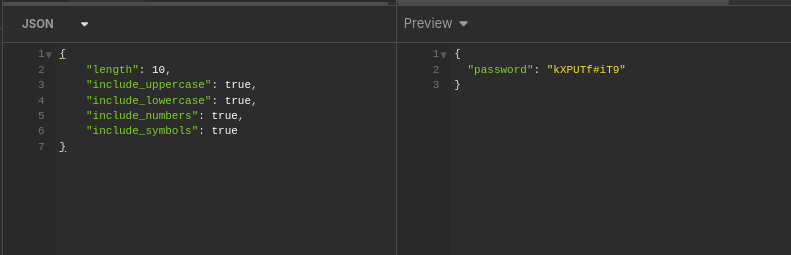

# Gerador de Senhas Seguras

Uma API construída utulizando o FastAPI para gerar senhas seguras e personalizaveis.

# Requisito
1. iniciar o venv `python3 -m venv venv`
2. habilitar o venv `source venv/bin/activate`

## Como usar
1. Instale as dependências: `pip install fastapi["standard"]`
2. Execute: `fastapi run app.py`
3. Acesse a documentação em `http://localhost:8000/docs`

## Exemplo de requisição utilizando o curl
```bash
curl -X POST "http://localhost:8000/generate-password" \
-H "Content-Type: application/json" \
-d '{"length": 16, "include_uppercase": true, "include_lowercase": true, "include_numbers": true, "include_symbols": true}'; echo ""
```

## Você pode tambem fazer requisições utilizando insominia ou postman

1. Instale o programa
2. faça uma requisição no body utilizando json ex:
``` 
    {
        "length": 10,
        "include_uppercase": true,
        "include_lowercase": true,
        "include_numbers": true,
        "include_symbols": true
    }
```


